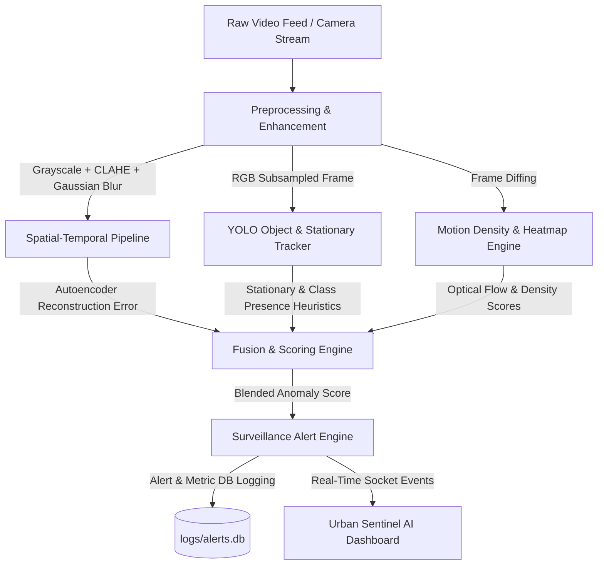

# 🛡️ Urban Sentinel AI: Crowd Anomaly Detection System

[](https://www.python.org/downloads/)
[](https://pytorch.org/)
[](https://flask.palletsprojects.com/)
[](https://opencv.org/)
[](https://opensource.org/licenses/MIT)

Urban Sentinel AI is a professional-grade, hardware-optimized surveillance intelligence pipeline. It uses spatial-temporal deep learning and computer vision to identify unusual activities, track crowd densities, and detect abandoned objects in high-risk pedestrian environments.

Designed to be incredibly lightweight and efficient, this pipeline delivers high-fidelity inference (8-12 FPS) on standard CPU hardware (e.g., Intel i5 laptops) using deep learning autoencoders, motion energy mapping, and YOLO-boosted heuristics.

---

## 🏗️ System Architecture

The pipeline processes surveillance feeds through three parallel, self-correcting analysis modules, culminating in a real-time analytics web dashboard:



### 🧠 Core Modules
1. **Module 1: Spatial-Temporal Autoencoder (CNN-LSTM)**  
   Processes sliding windows of 8 consecutive frames. The network (MobileNetV2 backbone + LSTM layers) reconstructs the sequences. High reconstruction errors indicate abnormal motion or structural anomalies.
2. **Module 2: Dynamic Motion Heatmap Engine**  
   Uses real-time background subtraction, morphological opening, and dynamic Gaussian smoothing to construct interactive visual overlays representing motion intensity.
3. **Module 3: YOLO-Boosted Object Tracking**  
   Runs YOLOv5 (subsampled to run every $N$ frames for CPU efficiency) to classify, track, and alert on static unattended bags, illegal vehicles in pedestrian zones, or skateboards.
4. **Surveillance Alert Engine**  
   Performs multi-criteria decision fusion. It aggregates scores, logs system state, and triggers WebSocket events to keep the browser updated immediately.

---

## ⚡ Quick Start Guide (Windows)

All files, pre-built models, and virtual environments are ready to run.

### 🔌 Step 1: Activate Virtual Environment
Open your terminal in the project directory and run:
```powershell
.\venv\Scripts\activate
```

### 🖥️ Step 2: Run the Web Dashboard
Start the real-time Flask Web UI:
```bash
python run_app.py
```
Open your web browser and go to:
👉 **[http://127.0.0.1:5001](http://127.0.0.1:5001)**

### 💻 Step 3: Run Command-Line Inference (CLI)
To run inference on individual test videos with live OpenCV display windows:
```bash
python app.py --video ucsd_ped1_009.mp4
```
To run headless and save the results as an annotated video:
```bash
python app.py --video ucsd_ped1_009.mp4 --save --no-display
```

---

## 📊 Evaluation & Benchmarking

### 📈 Model Accuracy Evaluation
Evaluate the model against UCSD Pedestrian dataset ground-truth bounding boxes and events to calculate ROC-AUC:
```bash
python evaluate.py
```
*Outputs standard ROC-AUC, accuracy, precision, and saves the ROC graph to `outputs/plots/roc_curve.png`.*

### ⚡ Performance & Latency Benchmarks
Run a latency benchmark to trace processing times of each frame across different pipeline modules (preprocessing, autoencoder, heatmap, YOLO):
```bash
python benchmark.py --video ucsd_ped1_009.mp4
```

---

## ⚙️ Configuration Setup (`config.json`)

You can fully control and calibrate the system behavior by editing `config.json`:

* **`anomaly_threshold`**: Calibrate when the system flags normal vs. abnormal actions (Default: `0.31`).
* **`yolo_every_n_frames`**: Sets YOLO run cadence. Higher means faster FPS; lower means denser tracking (Default: `10` processed frames).
* **`device`**: Set to `"cpu"` for general hardware, or `"cuda"` to accelerate using an NVIDIA GPU.
* **`dashboard`**: Configure Flask listener host/port settings.

---

## 📁 Repository Map

```
├── app/                  # Main Web Dashboard & core python packages
│   ├── core/             # Heatmap, Object Tracking, and Inference Pipeline
│   └── templates/        # Sleek Glassmorphism Dashboard UI HTML/CSS
├── models/               # Loaded deep learning autoencoder weights (.pth)
├── outputs/              # Directory for evaluation plots and annotated videos
├── run_app.py            # Dashboard launcher script
├── app.py                # Command-line interface launcher
├── evaluate.py           # Evaluation script for metrics & ROC plots
├── benchmark.py          # Frame latency benchmarking tool
├── generate_samples.py   # Dataset TIFF-to-MP4 video compilation utility
├── config.json           # Global system thresholds and settings
└── requirements.txt      # Comprehensive dependencies checklist
```

---

## 🛡️ License

This project is licensed under the MIT License - see the LICENSE file for details.
